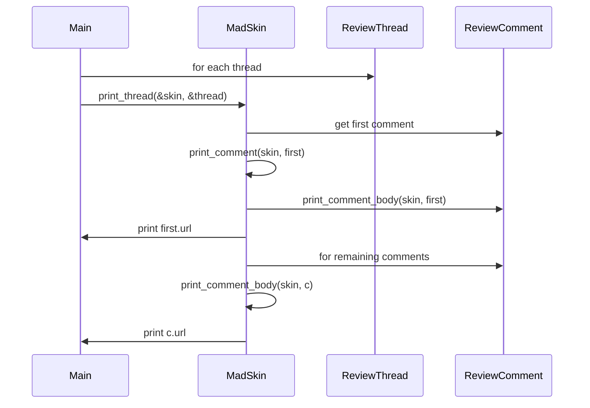

# vk Design

This document describes the design and functionality of the `vk` command line
application from user experience and architecture perspectives.

## Overview

`vk` (View Komments) is a CLI tool for inspecting unresolved GitHub pull request
comments. Users supply a pull request URL or number, and `vk` fetches the
associated review threads through the GitHub GraphQL API. Each thread is printed
with syntax highlighting using Termimad. Diffs appear once per thread, even when
multiple comments reference the same code.

## User Experience

- **Simple invocation**: `vk pr <url-or-number>` prints unresolved comments with
  colourful formatting.
- **Concise output**: Each thread shows the diff once followed by all comments,
  reducing clutter when multiple remarks target the same line.
- **Error visibility**: Failures encountered while printing a thread are logged
  to stderr instead of being silently discarded.

## Architecture

The code centres on three printing helpers:

1. `write_comment_body` formats a single comment body to any `Write` implementation.
2. `write_comment` includes the diff for the first comment in a thread.
3. `write_thread` iterates over a thread and prints each comment body in turn.

`run_pr` fetches all unresolved threads and calls `print_thread`. Errors from
`print_thread` are surfaced via logging.

### CLI arguments

Runtime flags and subcommand options live in
[src/cli_args.rs](../src/cli_args.rs).
Keeping these structures in a dedicated module isolates the lint expectations
generated by `clap` and keeps `main.rs` focused on orchestrating API calls and
printing results.
The public `GlobalArgs`, `PrArgs`, and `IssueArgs` structures are fully
documented so their purpose and merge semantics are clear to downstream users.

## Utility

Splitting the printing logic into reusable `write_*` functions enables testing
without capturing stdout. The behavioural test `write_thread_emits_diff_once`
verifies that diffs appear only once per thread.

## Sequence Diagram

