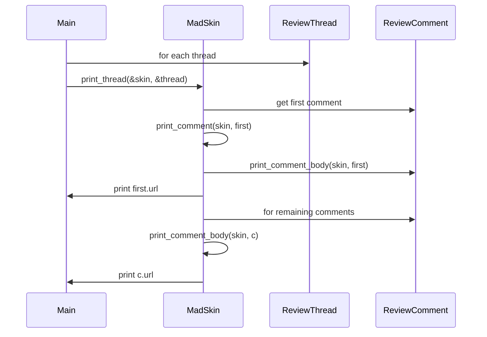
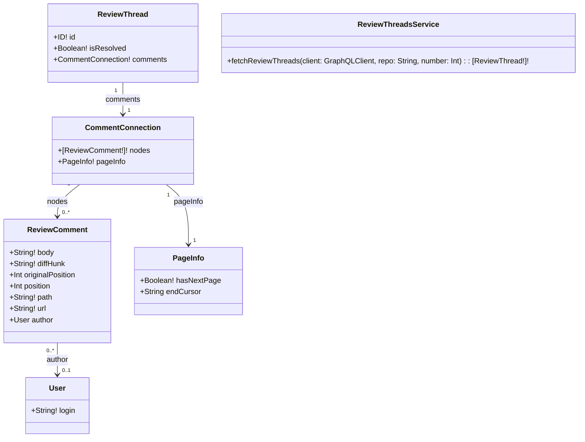
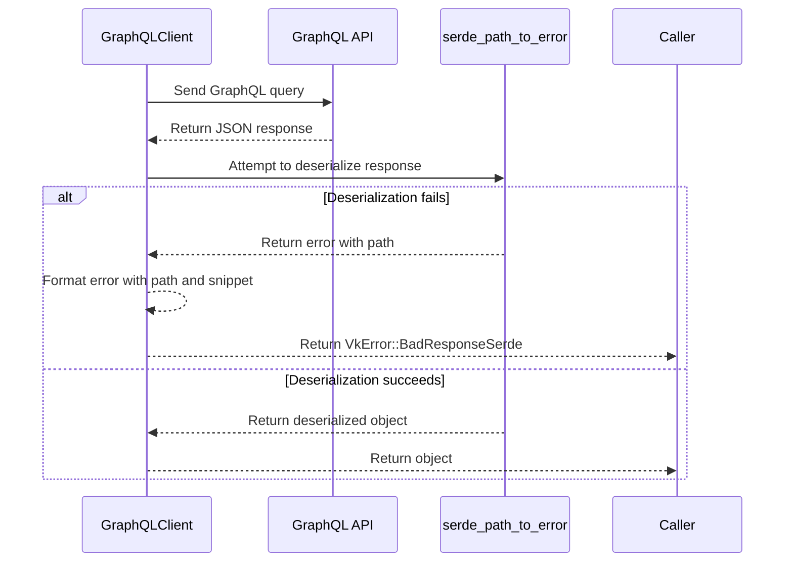

# vk Design

This document describes the design and functionality of the `vk` command line
application from user experience and architecture perspectives.

## Overview

`vk` (View Komments) is a CLI tool for inspecting unresolved GitHub pull
request comments. Users supply a pull request URL or number, and `vk` fetches
the associated review threads through the GitHub GraphQL API. Each thread is
printed with syntax highlighting using Termimad. Diffs appear once per thread,
even when multiple comments reference the same code.

## User Experience

- **Simple invocation**: `vk pr <url-or-number>` prints unresolved comments with
  colourful formatting.
- **Targeted review**: append file paths after the pull request to show only
  comments for those files.
- **Concise output**: Each thread shows the diff once followed by all comments,
  reducing clutter when multiple remarks target the same line.
- **Error visibility**: Failures encountered while printing a thread are logged
  to stderr instead of being silently discarded.
- **Banners**: Output opens with a `code review` banner and ends with an
  `end of code review` banner, framing the printed threads.

## Architecture

The code centres on three printing helpers:

1. `write_comment_body` formats a single comment body to any `Write`
   implementation.
2. `write_comment` includes the diff for the first comment in a thread.
3. `write_thread` iterates over a thread and prints each comment body in turn.

`run_pr` fetches the latest review from each reviewer and all unresolved
threads. After printing a `code review` banner and a summary, the reviews are
printed before individual threads. Broken pipe errors terminate output early;
other errors from `print_thread` and banner printing are surfaced via logging.
Once all threads have been printed, a final banner reading `end of code review`
confirms completion.

### CLI arguments

Runtime flags and subcommand options live in
[src/cli_args.rs](../src/cli_args.rs). Keeping these structures in a dedicated
module isolates the lint expectations generated by `clap` and keeps `main.rs`
focused on orchestrating API calls and printing results. The public
`GlobalArgs`, `PrArgs`, and `IssueArgs` structures are fully documented so
their purpose and merge semantics are clear to downstream users. `PrArgs`
accepts an optional list of file paths that limits output to matching comments.

Networking logic resides in [src/api/mod.rs](../src/api/mod.rs). It exposes the
`GraphQLClient` alongside `run_query`, `fetch_page`, and `paginate_all` helpers
used throughout the application. The client employs lightweight `Token`,
`Endpoint`, `Query`, and `Cursor` types to avoid parameter mix-ups. `run_query`
retries transient request failures with `backon`'s jittered exponential
backoff, attempting each query up to five times. `fetch_page` merges an
optional cursor into a variables map and rejects non-object input upfront. The
`paginate_all` helper loops until `PageInfo` indicates completion, discarding
any items fetched before an error occurs.

## Utility

Splitting the printing logic into reusable `write_*` functions enables testing
without capturing stdout. The behavioural test `write_thread_emits_diff_once`
verifies that diffs appear only once per thread.

Comment bodies can include raw HTML. The helper `collapse_details` uses
`html5ever` to parse each comment and collapse root `
` blocks to their
`
` text. Nested blocks are discarded to keep the output concise.

## Sequence Diagram

## Class Diagram

The diagram below outlines the relationships between review threads, comments,
and related page information as modelled in the GraphQL schema.

## GraphQL Error Handling

GraphQL requests are retried when a network error occurs or the response lacks
data. Retry behaviour is configurable through `RetryConfig`, covering the
number of attempts and the base delay for the exponential backoff. By default,
the client tries a query up to five times, waiting `200ms * 2^attempt` with
full jitter supplied by `backon` so concurrent callers spread out as delays
grow. Because `run_query` only returns after a full page has been fetched,
`paginate_all` never appends partial results, preserving order and avoiding
duplicates.

The diagram below illustrates how deserialization errors surface the JSON path
and a response snippet, helping developers quickly locate schema mismatches.

## Configuration and features

`vk` reads configuration files using `ortho_config`, which layers values from
files, environment variables and CLI arguments. JSON5 and YAML formats are
enabled through the `json5` and `yaml` features on `ortho_config`, which pull
in the required parsers as transitive dependencies.
