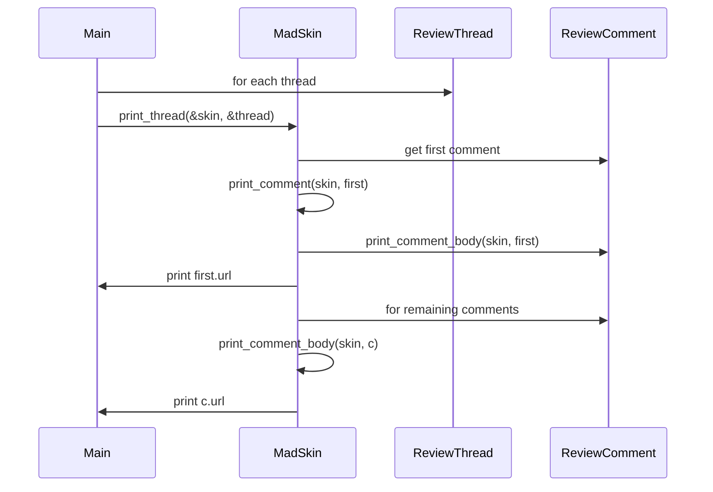
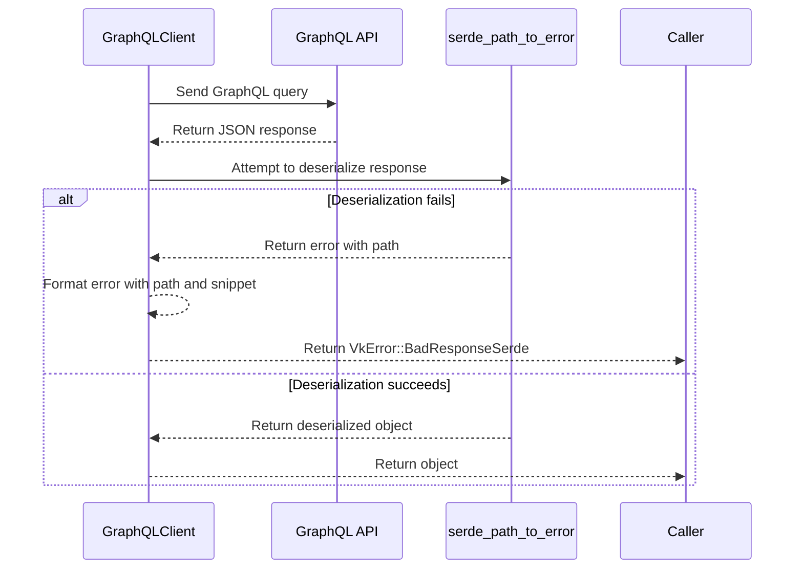

# vk Design

This document describes the design and functionality of the `vk` command line
application from user experience and architecture perspectives.

## Overview

`vk` (View Komments) is a CLI tool for inspecting unresolved GitHub pull
request comments. Users supply a pull request URL or number, and `vk` fetches
the associated review threads through the GitHub GraphQL API. Each thread is
printed with syntax highlighting using Termimad. Diffs appear once per thread,
even when multiple comments reference the same code.

## User Experience

- **Simple invocation**: `vk pr <url-or-number>` prints unresolved comments with
  colourful formatting.
- **Concise output**: Each thread shows the diff once followed by all comments,
  reducing clutter when multiple remarks target the same line.
- **Error visibility**: Failures encountered while printing a thread are logged
  to stderr instead of being silently discarded.
- **Completion notice**: A final banner marks the *end of code review*.

## Architecture

The code centres on three printing helpers:

1. `write_comment_body` formats a single comment body to any `Write`
   implementation.
2. `write_comment` includes the diff for the first comment in a thread.
3. `write_thread` iterates over a thread and prints each comment body in turn.

`run_pr` fetches the latest review banner from each reviewer and all unresolved
threads. The reviews are printed after the summary and before individual
threads. Errors from `print_thread` are surfaced via logging. Once all threads
have been printed, a final banner reading `end of code review` confirms
completion.

### CLI arguments

Runtime flags and subcommand options live in
[src/cli_args.rs](../src/cli_args.rs). Keeping these structures in a dedicated
module isolates the lint expectations generated by `clap` and keeps `main.rs`
focused on orchestrating API calls and printing results. The public
`GlobalArgs`, `PrArgs`, and `IssueArgs` structures are fully documented so
their purpose and merge semantics are clear to downstream users.

Networking logic resides in [src/api/mod.rs](../src/api/mod.rs). It exposes the
`GraphQLClient` alongside the `run_query` helper and pagination utilities used
throughout the application. The `paginate` helper loops until `PageInfo`
indicates completion, discarding any items fetched before an error occurs.

## Utility

Splitting the printing logic into reusable `write_*` functions enables testing
without capturing stdout. The behavioural test `write_thread_emits_diff_once`
verifies that diffs appear only once per thread.

Comment bodies can include raw HTML. The helper `collapse_details` uses
`html5ever` to parse each comment and collapse root `
` blocks to their
`
` text. Nested blocks are discarded to keep the output concise.

## Sequence Diagram

## GraphQL Error Handling

The diagram below illustrates how deserialisation errors surface the JSON path
and a response snippet, helping developers quickly locate schema mismatches.

## Configuration and features

`vk` reads configuration files using the `figment` crate. Support for JSON5 and
YAML formats is optional via the `json5` and `yaml` feature flags. These
features pull in the `figment-json5` and `serde_yaml` crates, respectively.
